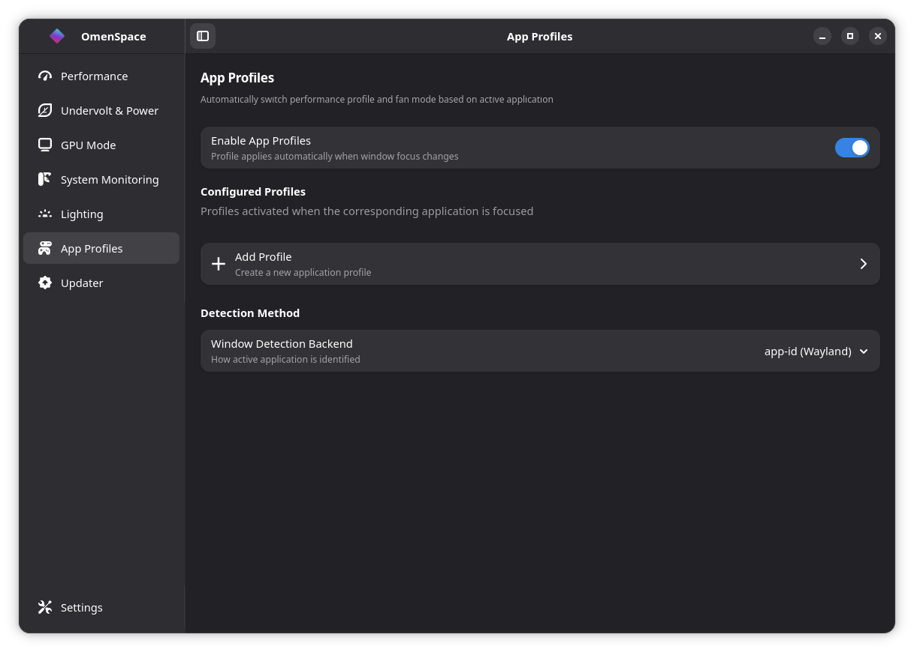
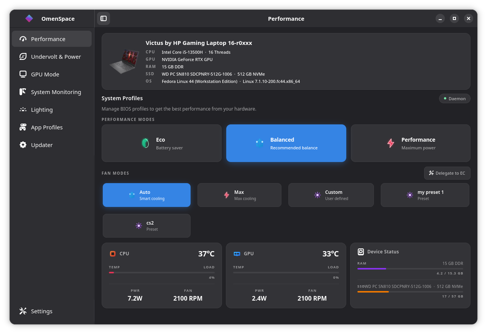
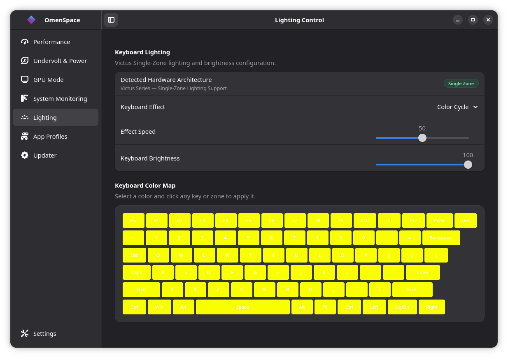
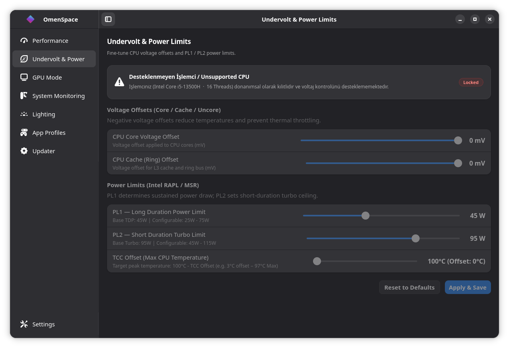
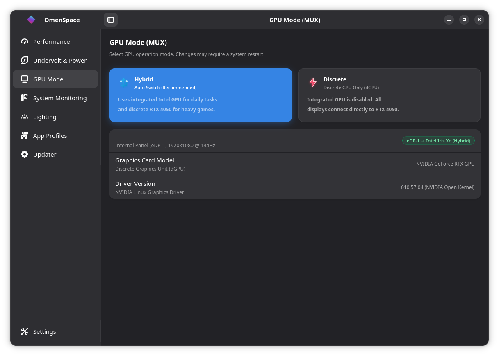
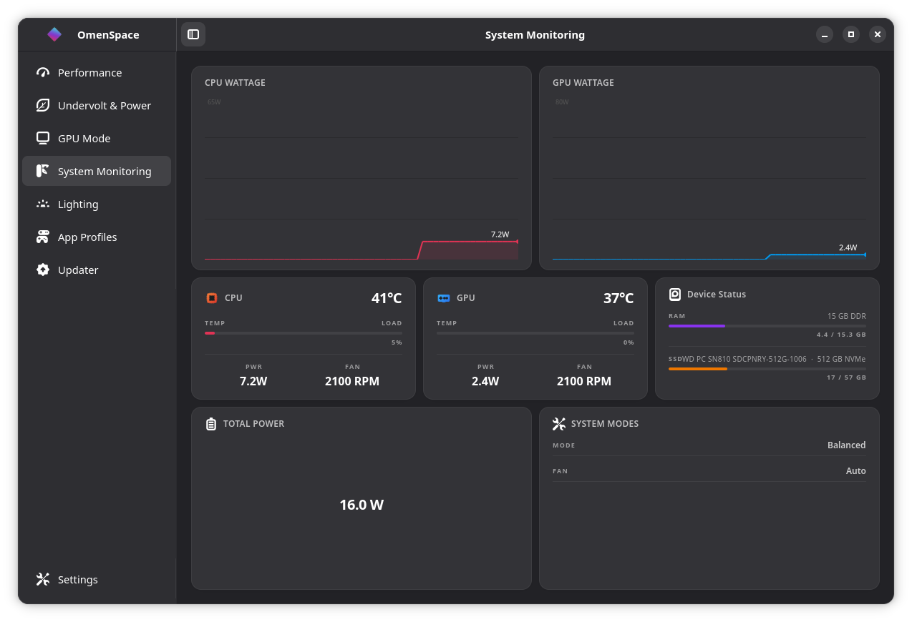
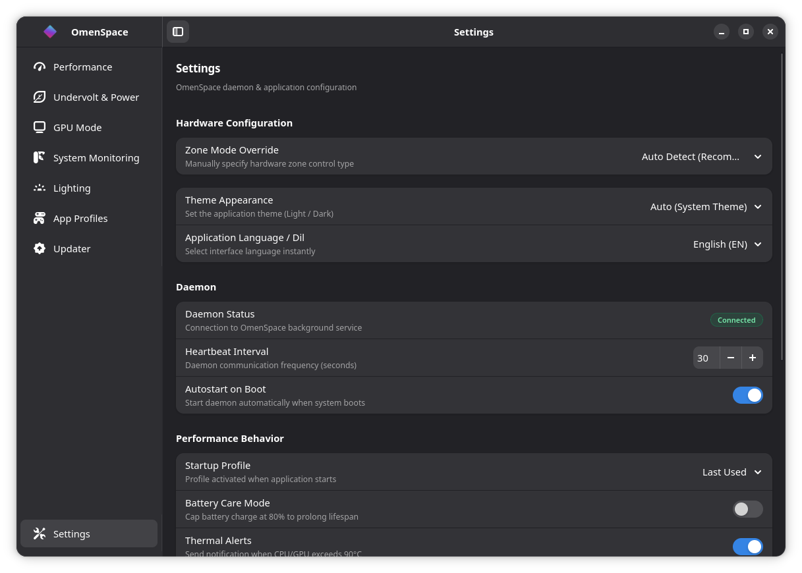
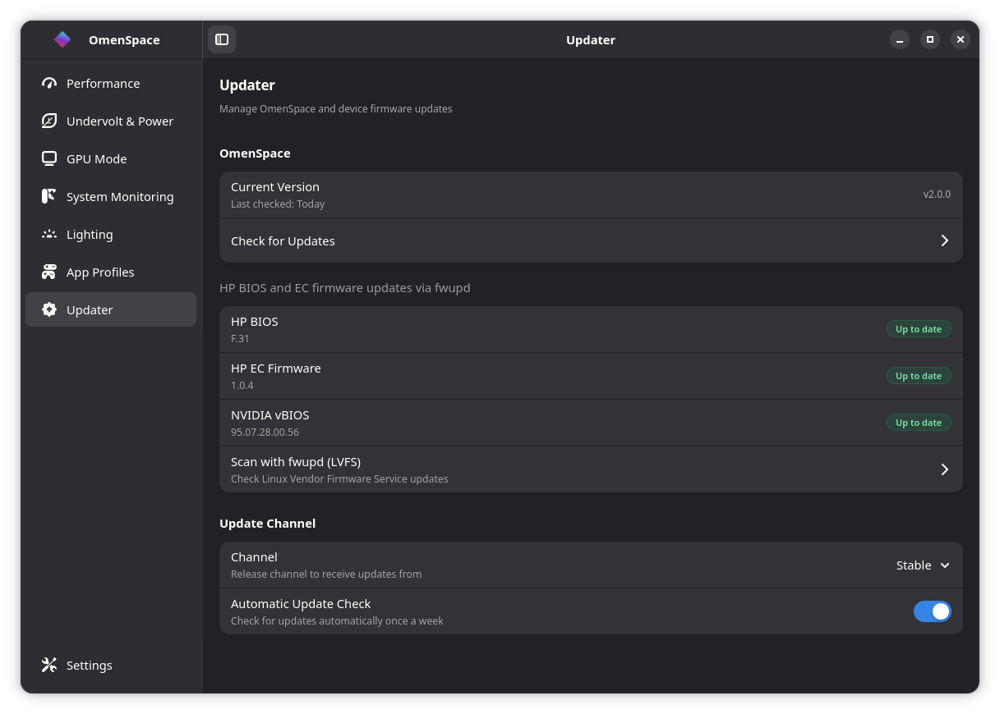
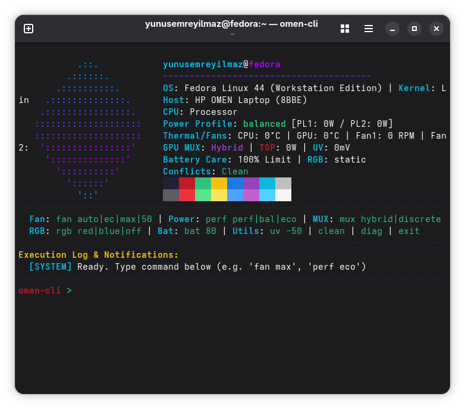

<div align="center">

```text
  ____  __  _________   _______                     
 / __ \/  |/  / __/ | \/ / __/ /_  ___ ________ 
/ /_/ / /|_/ / _/ |   / /\ \/ __ \/ _ `/ __/ -_)
\____/_/  /_/___/ |_\/_/___/ .__/\_,_/\__/\__/ 
                          /_/                    
```


**Next-Generation Linux control center for HP Omen, Victus & Transcend laptops.**  
An open-source, Rust-powered GTK4 suite for managing performance profiles, custom fan curves, RGB lighting, Ryzen SMU tuning, and hardware limits seamlessly on Linux.

[](LICENSE)
[]()
[]()

</div>

---

## 🌟 The Evolution: From OmenCtl to OMENSpace

**OMENSpace** is a complete, ground-up rewrite of the legacy Python-based *OmenCtl* project. We have transitioned from Python to **Rust** to deliver zero-cost abstractions, maximum memory safety, and native performance. 

### Why the upgrade?
| Feature / Metric | Legacy OmenCtl (Python) | **OMENSpace (Rust)** |
| :--- | :--- | :--- |
| **Performance & RAM** | ~40MB RAM (Python interpreter overhead) | **~2.8MB binary, < 5MB RAM** (Zero overhead) |
| **Architecture** | Sync loops, heavy `subprocess` usage | **Tokio Async**, Zero-fork `/proc` & Sysfs telemetry |
| **GUI Framework** | Python GTK Bindings (Sluggish) | **Native GTK4 & Libadwaita** (Extremely fast & responsive) |
| **Inter-Process Comm** | `pydbus` | `zbus` (Pure Rust, highly concurrent) |
| **New Hardware Tuning** | Standard ACPI Power Profiles | **Ryzen SMU Tuning, Undervolting & Fan Cleaning Mode!** |

---

## ⚡ Features at a Glance

* **Fan & Thermal Mastery:** Create custom Fan curve splines with a 15-sample moving average deadband for near-silent operation without thermal throttling. Includes a new **Fan Cleaning Mode** to blow out dust.
* **Power & Performance Switching:** Seamlessly toggle between `power-saver`, `balanced`, and `performance` hardware profiles via ACPI and WMI.
* **Ryzen SMU & Undervolting:** Direct MSR-based undervolting, TCC offset control, GPU TGP limits, and AMD Ryzen SMU tuning limits for maximum hardware control.
* **MUX Switch Control:** Native interface for Optimus / dGPU routing switching (uses undocumented WMI payload `0x52`).
* **RGB Keyboard Lighting:** Configure your 4-Zone or Per-Key keyboard backlighting with wave, breathing, cycle, and static colors. Hardware accelerated via sysfs.
* **Game & App Automation:** Define custom power limits and fan curves for individual games (Steam, Lutris, Flatpak). Zero-fork process detection doesn't waste CPU cycles.
* **Smart BIOS Checker:** Automatically checks HP servers for the latest BIOS update for your specific motherboard (DMI).

---

## 🏗️ Architecture Overview

The OMENSpace stack is split into four distinct Rust crates and a kernel module:

1. **`omen-space-daemon` (The Backend)**
   - Runs as a systemd service (`omen-space-daemon.service`) with root privileges.
   - Manages direct hardware interaction via WMI, ACPI, Sysfs, and MSR.
   - Exposes hardware control safely over **D-Bus** (`org.hp.omen.*`).

2. **`omen-gui` (The Frontend)**
   - A modern, responsive graphical interface built using **GTK4** and **Libadwaita**.
   - Runs in user-space without requiring `sudo`.
   - Communicates with the daemon exclusively via D-Bus (`zbus` crate).

3. **`omen-cli` (Command Line Interface)**
   - A fast terminal tool for users who prefer the command line or want to script hardware changes.

4. **`omen-tray` (System Tray)**
   - A lightweight background applet providing quick access to thermal profiles and fan modes from your desktop panel.

---

## 📸 Screenshots

| Profiles | Performance |
| :---: | :---: |
|  |  |

| RGB Lighting | Undervolting |
| :---: | :---: |
|  |  |

| MUX Switch | Diagnostics |
| :---: | :---: |
|  |  |

| Settings | BIOS Updater |
| :---: | :---: |
|  |  |

| Command Line Interface | |
| :---: | :---: |
|  | |

---

## 🚀 Installation

We provide a unified setup script to manage your installation. It automatically compiles the application from source with `LTO` and `opt-level=z` optimizations for maximum efficiency.

```bash
# Clone the repository
git clone https://github.com/yunusemreyl/OmenCtl.git
cd OmenCtl

# Install the application
chmod +x setup.sh
sudo ./setup.sh install
```

### Setup Commands
- `sudo ./setup.sh install` : Cleans up any legacy `omenctl` installations, builds the Rust binaries, installs system files, and starts the daemon.
- `sudo ./setup.sh update` : Pulls the latest changes from the git repository and reinstalls the application.
- `sudo ./setup.sh uninstall` : Completely removes OMENSpace, its daemon, and the DKMS kernel module from your system.

---

## 👨‍💻 Credits & Contributors

OMENSpace wouldn't exist without its amazing open-source community.

* **[yunusemreyl](https://github.com/yunusemreyl)** - Lead Developer
* **[tuxov](https://github.com/tuxov)** - Kernel Module Lead
* **[theantipopau](https://github.com/theantipopau/omencore)** - Inspiration and reference from omencore.
* **[OmenLinux/omen-rgb-keyboard](https://github.com/OmenLinux/omen-rgb-keyboard)** - The kernel module providing hardware-accelerated RGB lighting effects.

### Top Contributors
[@CodesRahul96](https://github.com/CodesRahul96), [@xcellsior](https://github.com/xcellsior), [@TitoTFP](https://github.com/TitoTFP), [@SafSaf0999](https://github.com/SafSaf0999), [@yijean34-source](https://github.com/yijean34-source).

*(For the full list of community members and bug testers, check the commit history—thank you all!)*

---

## ⚖️ License
OMENSpace is licensed under the **GNU General Public License v3.0** (GPL-3.0). See the [LICENSE](LICENSE) file for details.

*OMENSpace is an independent open-source project and is **NOT** officially affiliated with, authorized, or endorsed by **Hewlett-Packard (HP)**.*
